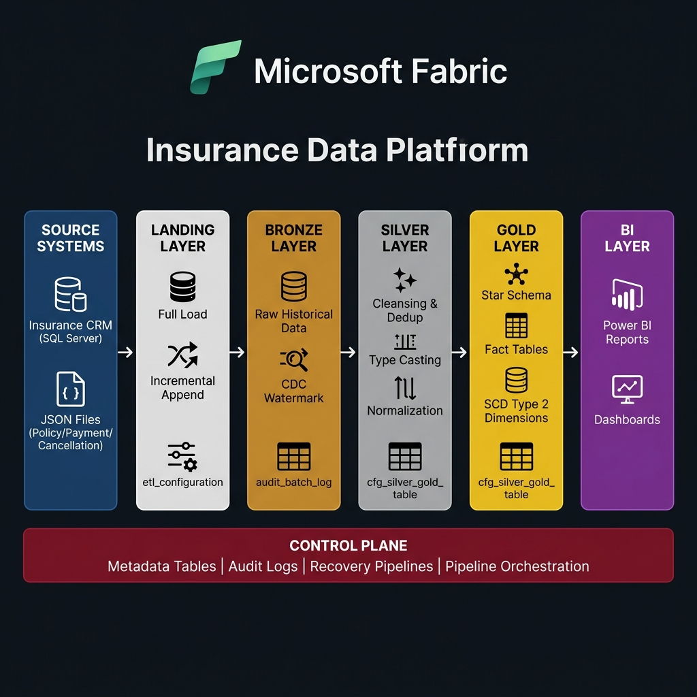

# 🏗️ Fabric Insurance Metadata-Driven Data Platform

> An end-to-end, metadata-driven data engineering pipeline for the insurance industry — built on **Microsoft Fabric** with a **Medallion Architecture** (Landing → Bronze → Silver → Gold).

---

## 📐 Architecture Overview



The platform ingests insurance data from multiple source systems, processes it through a structured multi-layer pipeline, and delivers curated data to Power BI dashboards — all driven by centralized metadata configuration tables.

---

## 🗂️ Table of Contents

- [Project Overview](#-project-overview)
- [Architecture & Data Flow](#-architecture--data-flow)
- [Metadata-Driven Design](#-metadata-driven-design)
- [Recovery Pipeline](#-recovery-pipeline)
- [Repository Structure](#-repository-structure)
- [Fabric Artifacts](#-fabric-artifacts)
- [Power BI Reports](#-power-bi-reports)
- [Business Process Context](#-business-process-context)
- [Getting Started](#-getting-started)
- [Team](#-team)

---

## 📖 Project Overview

**Rookie2Engineer** is a production-grade data engineering project built on **Microsoft Fabric**. It ingests, transforms, and serves insurance data — covering quotations, policies, payments, and cancellations — to support downstream analytics and BI reporting.

### Key Capabilities

| Feature | Description |
|---|---|
| 🔄 **Full & Incremental Load** | Metadata-configured load strategies per table |
| 🧠 **Metadata-Driven** | No hardcoded logic — all pipelines read from config tables |
| 🔁 **Auto Recovery** | Failed pipeline sessions are automatically detected and re-run |
| 📊 **SCD Type 2** | Slowly Changing Dimensions tracked for historical accuracy |
| 🔍 **Audit Logging** | Full traceability at batch, session, and table level |
| ✅ **Data Validation** | Silver layer validation notebooks catch data quality issues |

---

## 🔄 Architecture & Data Flow

### Pipeline Layers

```
Source Systems → Landing → Bronze → Silver → Gold → Power BI
```

#### 1. 🔵 Source Systems
| Source | Type | Data |
|---|---|---|
| Insurance CRM | SQL Server | Customers, Quotations |
| JSON Files | Incremental / Full | Policies, Payments, Cancellations |

#### 2. ⬜ Landing Layer
- Initial raw storage zone for all ingested data
- Load strategy controlled by `etl_configuration` metadata table:
  - **Full Load** — truncate & reload entire dataset
  - **Incremental (Append)** — load only new records based on watermark

#### 3. 🟤 Bronze Layer
- Stores complete raw historical data with **no business transformations**
- Tracks ingestion metadata: `ingestion_date`, `source_file`, `batch_id`
- Supports **CDC (Change Data Capture)** via watermark columns
- Linked to `audit_batch_log` for full traceability

#### 4. ⚪ Silver Layer
- Applies business transformations:
  - **Null handling & deduplication**
  - **Data type standardization & casting**
  - **Cross-source integration & normalization**
- Output stored in structured Silver Lakehouse schema
- Validated by `NB_Validate_Silver_Records` notebook

#### 5. 🟡 Gold Layer
- Builds **Star Schema** (Fact + Dimension tables) optimized for analytics
- Applies **SCD Type 2** on dimension tables (tracks historical changes via `row_hash`)
- Fact tables use append/upsert logic
- Driven by `cfg_silver_gold_table` metadata configuration

#### 6. 🟣 BI Layer
- Final data consumed by **Power BI**:
  - `OperationalDashboard` — real-time pipeline monitoring
  - `QuotationSalesDashboard` — sales & quotation analytics
  - `monitor_report` — audit & data quality tracking

### Control Plane

A shared **Control Plane** supports all layers:

| Component | Purpose |
|---|---|
| `cfg.etl_configuration` | Controls source-to-landing load strategies |
| `cfg.cfg_silver_gold_table` | Drives Silver→Gold notebook routing & table config |
| `cfg.cfg_table_watermark` | Tracks high-watermark for incremental loads |
| `cfg.cfg_landing_bronze_table` | Maps landing files to Bronze targets |
| `audit.audit_batch_log` | Pipeline-level execution tracking |
| `audit.audit_session_log` | Session-level tracking per run |
| `audit.audit_table_session_log` | Table-level granular status & row counts |

---

## 🧠 Metadata-Driven Design

All pipeline behavior is controlled by metadata tables — **no hardcoded table names, file paths, or load logic** in notebooks.

```
etl_configuration
      │
      ▼
pl_master_etl  ──→  pl_raw_to_landing
                ──→  pl_landing_to_bronze
                ──→  pl_bronze_to_silver
                ──→  pl_silver_to_gold
```

Each pipeline reads its own config slice and dynamically:
- Constructs file paths
- Selects load strategy (Full / Incremental)
- Routes data to the correct target table
- Logs results back to audit tables

---

## 🔁 Recovery Pipeline

The recovery system automatically detects failed sessions from a previous batch run and re-processes only the failed tables — **no need to restart the entire pipeline**.

### Recovery Flow

```
pl_recovery_table_session
        │
        ▼
nb_define_failed_layer      ← Identifies which layer failed (Bronze/Silver/Gold)
        │
        ▼
nb_get_failed_session_table ← Fetches failed table list from audit logs
        │
        ├──→ pl_recovery_landing_to_bronze
        ├──→ pl_recovery_bronze_to_silver
        └──→ pl_recovery_silver_to_gold
                │
                ▼
        nb_update_status    ← Updates audit log status after recovery
```

### Recovery Notebooks

| Notebook | Role |
|---|---|
| `nb_define_failed_layer` | Queries `audit_table_session_log` to find the failed layer |
| `nb_get_failed_session_table` | Returns JSON list of failed tables with session metadata |
| `nb_copy_data_to_bronze` | Re-runs copy logic for Bronze recovery |
| `nb_update_status` | Updates session/table status in audit logs post-recovery |
| `nb_gold_parent_recovery` | Orchestrates Gold layer re-processing |

---

## 📁 Repository Structure

```
Fabric_Insurance_Metadata_Driven/
│
├── 📁 Carpro/                          # Business requirements & mock data
│
├── 📁 Rookie2Engineer/
│   ├── 📁 fabric_source/               # All Microsoft Fabric artifacts
│   │   │
│   │   ├── 📁 pipeline_optimization_folder/
│   │   │   ├── master_etl_folder/          # pl_master_etl (orchestrator)
│   │   │   ├── raw_to_landing_folder/      # Source → Landing pipelines
│   │   │   ├── landing_to_bronze_folder/   # Landing → Bronze pipelines
│   │   │   ├── bronze_to_silver_folder/    # Bronze → Silver notebooks
│   │   │   └── silver_to_gold_folder/      # Silver → Gold notebooks
│   │   │
│   │   ├── 📁 recovery_pipeline_folder/    # Auto-recovery pipelines & notebooks
│   │   │
│   │   ├── 📁 validate_folder/             # Silver data quality validation
│   │   │
│   │   ├── 📁 schemas_and_tables/          # DDL notebooks for all layers
│   │   │
│   │   ├── 📁 sharing/                     # Demo & testing notebooks
│   │   │
│   │   ├── 🏠 Rookie2Engineer_Lakehouse.Lakehouse
│   │   └── 🏛️ Rookie2Engineer_Warehouse.Warehouse
│   │       ├── audit/   (audit_batch_log, audit_session_log, ...)
│   │       ├── cfg/     (etl_configuration, cfg_silver_gold_table, ...)
│   │       ├── validate/
│   │       └── web/
│   │
│   ├── 📁 documents/                   # Full project documentation (Markdown)
│   │
│   ├── 📊 OperationalDashboard.Report
│   ├── 📊 QuotationSalesDashboard.Report
│   ├── 📊 monitor_report.Report
│   ├── 📐 OperationalDashboard.SemanticModel
│   ├── 📐 sm_monitoring_report.SemanticModel
│   └── 📐 gold_layer_validation.SemanticModel
│
├── 📁 powerbi-embedded-demo/           # PowerBI Embedded web demo app
├── 📁 docs/images/                     # Architecture diagrams & visuals
├── 📄 azure-pipelines.yml              # CI/CD pipeline config
└── 📄 README.md
```

---

## 🛠️ Fabric Artifacts

### Pipelines
| Pipeline | Description |
|---|---|
| `pl_master_etl` | Top-level orchestrator — triggers all sub-pipelines |
| `pl_raw_to_landing` | Ingests from SQL Server & JSON sources to Landing |
| `pl_landing_to_bronze` | Promotes Landing data to Bronze with audit logging |
| `pl_bronze_to_silver` | Transforms Bronze → Silver (cleanse, deduplicate) |
| `pl_silver_to_gold` | Builds Star Schema in Gold layer |
| `pl_recovery_*` | Recovery pipelines per layer (Landing/Bronze/Silver/Gold) |

### Notebooks
| Notebook | Layer | Role |
|---|---|---|
| `nb_schemas` | Setup | Creates all Lakehouse schemas |
| `nb_bronze_tables` | Bronze | DDL for Bronze delta tables |
| `nb_silver_tables` | Silver | DDL for Silver delta tables |
| `nb_gold_tables` | Gold | DDL for Gold fact/dim tables |
| `NB_Validate_Silver_Records` | Silver | Data quality validation |
| `nb_define_failed_layer` | Recovery | Identifies failed layer |
| `nb_get_failed_session_table` | Recovery | Fetches failed table list |
| `nb_update_status` | Recovery | Updates audit log after recovery |

---

## 📊 Power BI Reports

| Report | Description |
|---|---|
| **OperationalDashboard** | Real-time monitoring of pipeline health, row counts, and session statuses |
| **QuotationSalesDashboard** | Sales KPIs, quotation conversion rates, agent performance |
| **monitor_report** | Audit log analysis — batch durations, failure rates, data quality metrics |

---

## 💼 Business Process Context

### Insurance Quotation Lifecycle
```
Submission → Risk Assessment → Pricing → Negotiation → Binding / Rejection
```

### Policy Issuance Process
```
Verification → Premium Confirmation → Payment Collection → Active Policy
      └──→ Claims Handling
      └──→ Renewal / Cancellation
```

### Domain Entities
| Entity | Source | Description |
|---|---|---|
| Customer | CRM (SQL Server) | Policyholder profile |
| Quotation | CRM (SQL Server) | Pre-sale pricing request |
| Policy | JSON (Full Load) | Issued insurance contract |
| Payment | JSON (Incremental) | Premium payment records |
| Cancellation | JSON (Incremental) | Policy termination events |

---

## 🚀 Getting Started

### Prerequisites
- Microsoft Fabric workspace with Lakehouse and Warehouse
- SQL Server source with insurance CRM data
- JSON landing files stored in Fabric OneLake

### Deployment Steps

```bash
# 1. Clone the repository
git clone git@github.com:wibu1105/Fabric_Insurance_Metadata_Driven.git

# 2. Deploy Fabric artifacts
#    Import notebooks and pipelines from fabric_source/ into your Fabric workspace

# 3. Initialize schemas and tables
#    Run: nb_schemas → nb_bronze_tables → nb_silver_tables → nb_gold_tables

# 4. Populate metadata tables
#    Insert rows into cfg.etl_configuration and cfg.cfg_silver_gold_table

# 5. Trigger the master pipeline
#    Run: pl_master_etl
```

### Running Recovery
If a batch run partially fails:
```
Trigger: pl_recovery_table_session
  → Automatically detects failed layer & tables from audit logs
  → Re-runs only the failed tables
  → Updates audit log with new status
```

---

## 📚 Documentation

Full documentation is available in `Rookie2Engineer/documents/`:
- Architecture diagrams
- Data flow specifications
- Table schema definitions
- Business process walkthroughs (Quotation Lifecycle, Policy Issuance)
- Metadata configuration guide

---

## 👥 Team

Built by the **Rookie2Engineer** team as part of the **NashTech Data Engineering Program**.

---

*Built with ❤️ on Microsoft Fabric*