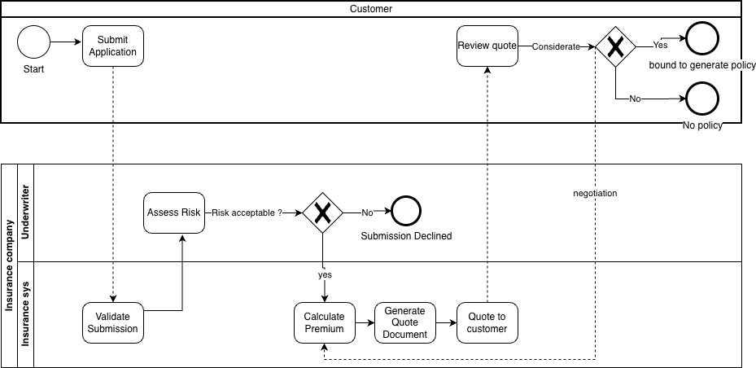

Insurance Business Process

# 1. Insurance Quotation Lifecycle

## Overview

The quotation lifecycle is the end-to-end journey from a customer's initial interest in coverage to a binding decision. It begins with submission intake and concludes in either binding where the quote becomes an active policy or rejection, where no agreement is reached.

## Quotation Concept

A quotation is a price or cost estimate that the insurer provides to a potential customer before they purchase insurance. It is the formal price offer that the customer evaluates before deciding to bind a policy. The quotation is personalised: it is built from details about the individual customer and their vehicle, which the insurer uses to assess the risk of the customer filing a claim. A standard quotation document contains the premium amount, the coverage details, the deductibles or excess amounts, the policy duration, and the terms and conditions of the offer. A concrete example from our research is a Toyota Camry quote with collision coverage at ten million Vietnamese dong per year, valid for fourteen days.

## Submission and Data Intake

The lifecycle begins when the customer, either directly or via a broker or agent, submits an application for a specific insurance product. In agent-led flows the agent enters customer and vehicle data into the insurer's system; in self-service flows the customer enters their own details. The system then validates the submitted data and performs an initial check against the customer's driving history. From a data perspective, this phase is the origin point for both Customer master data and Vehicle master data in our model, so the quality controls applied here determine the integrity of every downstream calculation.

## Risk Assessment and Underwriting

Underwriters, or an automated digital underwriting system, review the submission to determine the risk level of insuring the customer. The output of the review is a recommendation on whether to accept or decline the submission. The risk factors explicitly documented in our research include the customer's driving history, the vehicle's usage and mileage, the geographic location, the driver's age, and the car type. Additional underwriting concerns flagged in the research include luxury vehicles, high insured amounts, and prior claim history. This is the most data-intensive phase of the lifecycle and is likely to be the highest-value area for predictive scoring in later iterations of the project.

## Premium Calculation and Pricing

Once the risk has been assessed, the insurer applies an algorithm that calculates the premium. The calculation starts from a base cost and is then adjusted for the relevant risk factors and any applicable discounts. The underlying business rule, which our data model will need to replicate or report on, can be expressed as premium equals a function of base cost, risk factors, and discounts. Confirming the actual coefficients and discount rules with the business will be a prerequisite for any meaningful pricing analysis.

## Quote Presentation

The quotation document is generated and delivered to the customer for review. Insurers typically issue multiple quotes across different coverage tiers — for example a basic, a standard, and a premium option — so the customer can compare and choose the package that fits their needs and budget. This multi-tier behaviour means our data model must support a one-to-many relationship between a customer submission and the quotes it produces, rather than a one-to-one mapping.

## Negotiation and Modification

The customer may request adjustments to the quotation rather than accept it as offered. The most commonly adjusted elements are coverage limits, deductibles, and overall cost. The insurer reviews each requested modification and decides whether it can be accommodated. This phase typically iterates back and forth until both parties either reach agreement, which leads to acceptance, or become unable to agree, which leads to rejection. Each negotiation iteration is effectively a new version of the quote, so quote versioning should be considered when modelling the data.

## Binding, Acceptance, or Rejection

If the customer accepts, the quote is bound and the process moves forward into the Policy Issuance Process described in Section 2. Acceptance triggers a payment request, with the customer typically given between seven and thirty days to pay. Once payment is received, a formal policy is issued. If negotiation fails and no agreement is reached, the lifecycle ends in rejection and no policy is created.

Diagram of quotation process

# 2. Policy Issuance Process

## Overview

Once a quotation has been accepted, the insurer issues a formal policy that becomes the legally binding contract between the insurer and the customer. This section covers issuance itself as well as the ongoing policy lifecycle — administration, claims, and renewal

## Policy Definition

A policy is a legally binding contract between the insurer and the customer or policyholder. It becomes the active contract the moment it is issued. A standard policy contains three core components: the Insuring Agreement, which summarises the major promises of the insurer and states what is covered; the Exclusions, which list the items or scenarios the policy will not pay for; and the Conditions, which set out the requirements that must be met for a claim to be honoured. The standard data fields recorded on an issued policy include the policy number, the final agreed coverage, the effective dates of coverage, the insured vehicle details, and the legal terms.

## Pre-Issuance Verification

Before a policy can be issued, the insurer verifies the accepted quotation. This means confirming the quotation has not expired, that the correct version is being used, and that any changes negotiated with the customer have been accurately reflected in the document. Customer and vehicle information is then validated to confirm that all critical data is recorded and correct, and the customer's acceptance and intent to purchase is explicitly confirmed at this point.

## Final Review and Approval

The insurer performs a final review of the risk and either approves or rejects the policy issuance. The items commonly re-checked at this stage include the driver's driving history, the presence of luxury vehicles, high insured amounts, and prior claim history. This phase exists as a safeguard so that any risk concerns identified after the original underwriting can still block issuance.

## Premium Confirmation

Before billing the customer, the insurer confirms the final base premium together with any applicable discounts, taxes, and service fees. This is the last opportunity for the cost to be reconciled and locked before the customer is formally committed to payment.

## Payment Collection and Verification

The initial payment is collected from the customer and the insurer verifies that the payment was made in the correct amount. Payment is a strict prerequisite for policy activation — without a verified payment, no coverage is provided regardless of all other steps being complete.

## Policy Document Issuance

A formal policy document is issued covering the coverage details, limits, exclusions, and the final premium. The documents typically delivered to the customer include the policy record itself, a certificate of insurance, the terms and conditions, and a customer card. From this point on, the customer has tangible evidence of their coverage.

## Coverage Activation

Coverage is activated upon issuance and the policy becomes an active contract between the insurer and the customer. The customer is notified once activation is complete. From this point forward, claims can be made against the policy; before this point, no claim is payable regardless of the circumstances. Policy status transitions — from Issued to Active to Expired or Cancelled — should be modelled as state changes with timestamps so that we can accurately report on the size of the active book at any point in time.

## Policy Administration

Throughout the policy's active term, the insurer handles ongoing administrative tasks including endorsements, billing, renewals, and compliance. Typical changes that a policyholder might request during this period include adding a new driver to the policy, increasing coverage, or updating their contact details. Communication with the customer continues throughout the term and any changes are reflected back into the policy record.

## Billing and Premium Collection

Premiums are billed according to the customer's chosen payment plan, which may be annual, monthly, or another agreed cadence. The insurer sends invoices, processes payments, and manages any delinquencies that occur during the policy's active term.

## Claims Handling

If the policyholder experiences a loss — for example a car accident — they report the loss to the insurer. A claims adjuster then investigates the incident, validates the claim, evaluates the extent of the loss, and processes the payout based on the policy terms. A claim can only be paid if the policy conditions have been met; if the conditions have not been met, the insurer may deny the claim. Claims is one of the most analytically valuable data domains in any insurance business because it drives loss ratio analysis, fraud detection, and feedback into future pricing.

## Renewal

As the policy approaches its expiry date, it is reviewed and the underwriting team re-evaluates the risk based on the customer's claims history and any other changes. The insurer then sends a renewal offer to the customer. The customer can accept the renewal as offered, modify their coverage, allow the policy to lapse, or shop with alternative providers. Renewal prediction is a common analytical use case that this lifecycle data supports.

## Policy Cancellation and Termination

When a policy ends, the lifecycle is complete. A new lifecycle begins if the customer continues coverage elsewhere, whether with the same insurer through a renewal or with a different insurer entirely. Cancellation can also occur mid-term if either party initiates it, and the data model should distinguish between scheduled expiry and early cancellation.

.png)

Diagram of policy process

