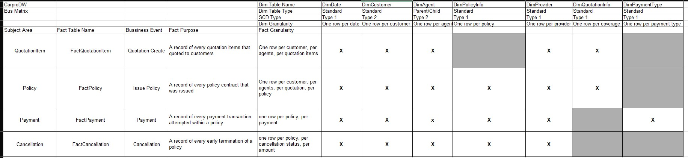

# Table Definition

## 1. Dimension Tables

The following per-table column definitions have been synchronized with the DBML in the "Physical DBML Schema" section.

#### `DimDate`
**SCD Type:** Type 1 | **Table Type:** Standard | **Suroggate Key:** Autoincremental

| Column | Data Type | Key | Nullable | Default |
|---|---|---|---|---|
| date_key | int | PK | False | -1 |
| full_date | date | | False | 1900-01-02 |
| date_long_description | string | | True |  |
| date_short_description | string | | True |  |
| day_name | string | | True |  |
| day_short_name | string | | True |  |
| month_name | string | | True |  |
| month_short_name | string | | True |  |
| day_of_year | int | | True |  |
| week_number | int | | True |  |
| day_of_week | int | | True |  |
| month_number | int | | True |  |
| day_of_month | int | | True |  |
| quarter_number | int | | True |  |
| day_of_quarter | int | | True |  |
| year_number | int | | True |  |
| is_weekend | boolean | | True |  |

#### `DimCustomer`
**SCD Type:** Type 2 | **Table Type:** Standard | **Suroggate Key:** Autoincremental

| Column | Data Type | Key | Nullable | Default | SCD Type |
|---|---|---|---|---|---|
| customer_key | bigint | PK | False | -1 | Type 1 |
| customer_id | string | | False | Unknown |Type 1|
| full_name | string | | True |  | Type 2 |
| gender | string | | True |  |Type 1|
| date_of_birth | date | | True |  |Type 1|
| phone_number | string | | True |  |Type 1|
| email | string | | True |  |Type 1|
| city | string | | True |  |Type 2 |
| district | string | | True |  |Type 2 |
| created_date | timestamp | | True |  |Type 1|
| effective_start_date | timestamp | | False | 1900-01-02 |Type 1|
| effective_end_date | timestamp | | False | 9999-12-31 |Type 1|
| is_current | boolean | | False | False |Type 1|

#### `DimAgent`
**SCD Type:** Type 2 | **Table Type:** Parent/Child | **Suroggate Key:** Autoincremental

| Column | Data Type | Key | Nullable | Default | SCD Type |
|---|---|---|---|---|---|
| agent_key | bigint | PK | False | -1 |Type 1|
| agent_id | string | | False | Unknown |Type 1|
| agent_name | string | | True |  |Type 2 |
| region | string | | True |  |Type 2 |
| branch | string | | True |  |Type 2 |
| manager_name | string | | True |  |Type 2 |
| created_date | timestamp | | True |  |Type 1|
| effective_start_date | timestamp | | False | 1900-01-02 |Type 1|
| effective_end_date | timestamp | | False | 9999-12-31 |Type 1|
| is_current | boolean | | False | False |Type 1|

#### `DimPolicyInfo`
**SCD Type:** Type 1 | **Table Type:** Standard | **Suroggate Key:** Autoincremental

| Column | Data Type | Key | Nullable | Default |
|---|---|---|---|---|
| policy_info_key | bigint | PK | False | -1 |
| policy_id | string | | False | Unknown |
| policy_number | string | | False | Unknown |
| policy_start_date | date | | False | 1900-01-02 |
| policy_end_date | date | | True |  |
| is_deleted | boolean | | False | False |

#### `DimProvider`
**SCD Type:** Type 1 | **Table Type:** Standard | **Suroggate Key:** Autoincremental

| Column | Data Type | Key | Nullable | Default |
|---|---|---|---|---|
| provider_key | bigint | PK | False | -1 |
| provider_code | string | | False | Unknown |
| provider_name | string | | False | Unknown Provider |
| provider_group | string | | True |  |
| active_flag | boolean | | False | False |
| is_deleted | boolean | | False | False |


#### `DimVehicle`
**SCD Type:** Type 1 | **Table Type:** Standard | **Suroggate Key:** Autoincremental

| Column | Data Type | Key | Nullable | Default |
|---|---|---|---|---|
| vehicle_key | bigint | PK | False | -1 |
| customer_key | bigint | FK | False | Unknown |
| vehicle_id | string | | False | Unknown |
| plate_number | string | | False | Unknown |
| vehicle_brand | string | | True |  |
| vehicle_model | string | | True |  |
| manufacture_year | int | | True |  |
| vehicle_value | decimal(18,2) | | True |  |
| is_deleted | boolean | | False | False |

#### `DimPaymentType`
**SCD Type:** Type 1 | **Table Type:** Standard | **Suroggate Key:** Autoincremental

| Column | Data Type | Key | Nullable | Default |
|---|---|---|---|---|
| payment_type_key | bigint | PK | False | -1 |
| payment_method | string | | False | Unknown |
| payment_description | string | | True |  |
| is_deleted | boolean | | False | False |

#### `DimQuotationInfo`
**SCD Type:** Type 1 | **Table Type:** Standard | **Suroggate Key:** Autoincremental

| Column | Data Type | Key | Nullable | Default |
|---|---|---|---|---|
| quotation_info_key | bigint | PK | False | -1 |
| quotation_id | string | | False | Unknown |
| package_code | string | | False | Unknown |
| is_deleted | boolean | | False | False |

---

## 2. Fact Tables

#### `FactQuotationItem`
| Column | Data Type | Key | Reference | Nullable | Default |
|---|---|---|---|---|---|
| customer_key | bigint | FK | DimCustomer.customer_key | False | Unknown Customer |
| agent_key | bigint | FK | DimAgent.agent_key | False | Unknown Agent |
| provider_key | bigint | FK | DimProvider.provider_key | False | Unknown Provider |
| coverage_type | string |  |  | False | Unknown Coverage |
| quotation_info_key | bigint | FK | DimQuotationInfo.quotation_info_key | False | Unknown Quotation Info |
| quotation_date_key | int | FK | DimDate.date_key | False | Unknown Date |
| quotation_expiry_date | timestamp |  |  | True |  |
| quotation_status | string |  |  | False | Unknown Status |
| quotation_premium_amount | decimal(18,2) | | | True |  |
| quotation_item_id | string | | | False |  |
| coverage_amount | decimal(18,2) | | | True |  |
| deductible_amount | decimal(18,2) | | | True |  |

#### `FactPolicy`
| Column | Data Type | Key | Reference | Nullable | Default |
|---|---|---|---|---|---|
| customer_key | bigint | FK | DimCustomer.customer_key | False | Unknown Customer |
| agent_key | bigint | FK | DimAgent.agent_key | False | Unknown Agent |
| issued_date_key | int | FK | DimDate.date_key | False | Unknown Date |
| provider_key | bigint | FK | DimProvider.provider_key | False | Unknown Provider |
| policy_info_key | bigint | FK | DimPolicyInfo.policy_info_key | False | Unknown Policy Info |
| quotation_info_key | bigint | FK | DimQuotationInfo.quotation_info_key | False | Unknown Quotation Info |
| policy_status | string |  |  | False | Unknown Status |
| policy_premium_amount | decimal(18,2) | | | True |  |

#### `FactPayment`

| Column | Data Type | Key | Reference | Nullable | Default |
|---|---|---|---|---|---|
| payment_id | string | PK | | False | **Suroggate Key:** Autoincremental |
| customer_key | bigint | FK | DimCustomer.customer_key | False | Unknown Customer |
| agent_key | bigint | FK | DimAgent.agent_key | False | Unknown Agent |
| provider_key | bigint | FK | DimProvider.provider_key | False | Unknown Provider |
| policy_info_key | bigint | FK | DimPolicyInfo.policy_info_key | False | Unknown Policy Info |
| payment_date_key | int | FK | DimDate.date_key | False | Unknown Date |
| payment_status | string | | | False | Unknown Status |
| payment_type_key | bigint | FK | DimPaymentType.payment_type_key | False | Unknown Type |
| payment_amount | decimal(18,2) | | | True |  |
| transaction_reference | string | | | True |  |

#### `FactCancellation`

| Column | Data Type | Key | Reference | Nullable | Default |
|---|---|---|---|---|---|
| cancellation_id | string | PK | | False | **Suroggate Key:** Autoincremental |
| cancellation_date_key | int | FK | DimDate.date_key | False | Unknown Date |
| customer_key | bigint | FK | DimCustomer.customer_key | False | Unknown Customer |
| agent_key | bigint | FK | DimAgent.agent_key | False | Unknown Agent |
| provider_key | bigint | FK | DimProvider.provider_key | False | Unknown Provider |
| policy_info_key | bigint | FK | DimPolicyInfo.policy_info_key | False | Unknown Policy Info |
| cancellation_reason | string |  | | False | Unknown Reason |
| refund_amount | decimal(18,2) | | | True |  |


# Business Bus Matrix



### Dimension Tables

| **Attribute**| **DimDate**| **DimCustomer**| **DimAgent** |**DimPolicyInfo**|**DimProvider** | **DimQuotationInfo**| **DimPaymentType**|
|---|---|---|---|---|---|---|---|
| **Dim Table Type** |Standard|Standard|Parent/Child | Standard | Standard | Standard | Standard  | Standard | Standard | Standard | Standard| Standard
| **SCD Type**        | Type 1                  | Type 2                  | Type 2                  | Type 1                    | Type 1                    | Type 1                    | Type 1                    | Type 1                    | Type 1                    | Type 1                    | Type 1                    | Type 1                    |
| **Granularity**| One row per date        | One row per customer    | One row per agent       | One row per policy        | One row per policy        | One row per provider      | One row per coverage      | One row per payment type  | One row per status        | One row per status        | One row per status        | One row per type          |
---

### Fact Tables


| **Subject Area** | **Fact Table Name** | **Business Event** | **Fact Purpose**| **Fact Granularity**| **DimDate** | **DimCustomer** | **DimAgent** | **DimPolicyInfo** | **DimProvider** | **DimQuotationInfo** | **DimPaymentType** |
|---|---|---|---|---|---|---|---|---|---|---|---|
|QuotationItem|FactQuotationItem|Quotation Create|A record of every quotation item quoted to customers| One row per customer, per agent, per quotation item X| X| X |X| | X|X||
|Policy| FactPolicy| Issue Policy| A record of every policy contract that was issued|One row per customer, per agent, per quotation, per policy| X| X| X|X| X| X| |
| Payment| FactPayment| Payment| A record of every payment transaction attempted within a policy| One row per policy, per payment| X | X| X|X| X| |X|
| Cancellation| FactCancellation| Cancellation| A record of every early termination of a policy| One row per policy, per cancellation status, per amount| X| X| X| X| X | ||


 
# Physical DBML Schema

```dbml
Table DimDate {
  date_key int [pk]
  full_date date
  date_long_description string
  date_short_description string
  day_name string
  day_short_name string
  month_name string
  month_short_name string
  day_of_year int
  week_number int
  day_of_week int
  month_number int
  day_of_month int
  quarter_number int
  day_of_quarter int
  year_number int
  is_weekend boolean
}

Table DimAgent {
  agent_id string
  agent_key bigint [pk]
  agent_name string
  region string
  branch string
  manager_name string
  created_date timestamp
  effective_start_date timestamp
  effective_end_date timestamp
  is_current boolean
}

Table DimPolicyInfo {
  policy_info_key bigint [pk]
  policy_id string
  policy_number string
  policy_start_date date
  policy_end_date date
  is_deleted boolean
}

Table DimProvider {
  provider_key bigint [pk]
  provider_code string
  provider_name string
  provider_group string
  active_flag int
  is_deleted boolean
}

Table DimVehicle {
  vehicle_key bigint [pk]
  customer_key bigint
  vehicle_id string
  plate_number string
  vehicle_brand string
  vehicle_model string
  manufacture_year int
  vehicle_value decimal(18,2)
  is_deleted boolean
}

Table DimPaymentType {
  payment_type_key bigint [pk]
  payment_method string
  payment_description string
  is_deleted boolean
}

Table DimCustomer {
  customer_key bigint [pk]
  customer_id string
  full_name string
  gender string
  date_of_birth date
  phone_number string
  email string
  city string
  district string
  created_date timestamp
  effective_start_date timestamp
  effective_end_date timestamp
  is_current boolean
}

Table DimQuotationInfo {
  quotation_info_key bigint [pk]
  quotation_id string
  package_code string
  is_deleted boolean
}

Table FactQuotationItem {
  customer_key bigint
  agent_key bigint
  provider_key bigint
  coverage_type string
  quotation_info_key bigint  
  quotation_date_key int
  quotation_expiry_date timestamp
  quotation_status string
  quotation_premium_amount decimal(18,2)
  quotation_item_id string
  coverage_amount decimal(18,2)
  deductible_amount decimal(18,2)
}

Table FactPolicy {
  customer_key bigint
  agent_key bigint
  issued_date_key int
  provider_key bigint
  policy_info_key bigint
  quotation_info_key bigint
  policy_status string
  policy_premium_amount decimal(18,2)
}

Table FactPayment {
  payment_id string [pk]
  customer_key bigint
  agent_key bigint
  provider_key bigint
  policy_info_key bigint
  payment_date_key int
  payment_status string
  payment_type_key bigint
  payment_amount decimal(18,2)
  transaction_reference string
}

Table FactCancellation {
  cancellation_id string [pk]
  cancellation_date_key int
  customer_key bigint
  agent_key bigint
  provider_key bigint
  policy_info_key bigint
  cancellation_reason string
  refund_amount decimal(18,2)
}

// --- FactQuotationItem RELATIONSHIPS ---
Ref: FactQuotationItem.quotation_date_key > DimDate.date_key
Ref: FactQuotationItem.agent_key > DimAgent.agent_key
Ref: FactQuotationItem.quotation_info_key > DimQuotationInfo.quotation_info_key
Ref: FactQuotationItem.provider_key > DimProvider.provider_key
Ref: FactQuotationItem.customer_key > DimCustomer.customer_key

// --- FactPolicy RELATIONSHIPS ---
Ref: FactPolicy.issued_date_key > DimDate.date_key
Ref: FactPolicy.provider_key > DimProvider.provider_key
Ref: FactPolicy.customer_key > DimCustomer.customer_key
Ref: FactPolicy.quotation_info_key > DimQuotationInfo.quotation_info_key
Ref: FactPolicy.policy_info_key > DimPolicyInfo.policy_info_key
Ref: FactPolicy.agent_key > DimAgent.agent_key

// --- FactPayment RELATIONSHIPS ---
Ref: FactPayment.payment_date_key > DimDate.date_key
Ref: FactPayment.payment_type_key > DimPaymentType.payment_type_key
Ref: FactPayment.policy_info_key > DimPolicyInfo.policy_info_key
Ref: FactPayment.customer_key > DimCustomer.customer_key
Ref: FactPayment.provider_key > DimProvider.provider_key
Ref: FactPayment.agent_key > DimAgent.agent_key

// --- FactCancellation RELATIONSHIPS ---
Ref: FactCancellation.cancellation_date_key > DimDate.date_key
Ref: FactCancellation.policy_info_key - DimPolicyInfo.policy_info_key
Ref: FactCancellation.customer_key > DimCustomer.customer_key
Ref: FactCancellation.provider_key > DimProvider.provider_key
Ref: FactCancellation.agent_key > DimAgent.agent_key

// --- Bridge RELATIONSHIPS ---
Ref: DimCustomer.customer_key < DimVehicle.customer_key
```