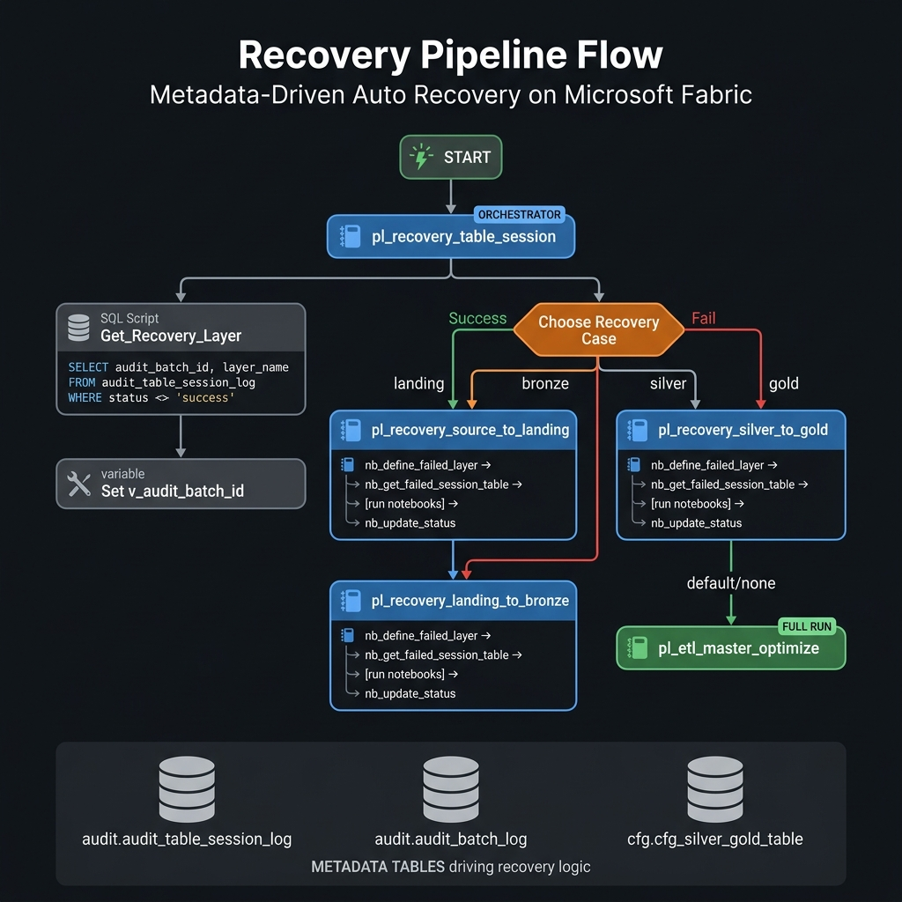

# 🔁 Recovery Pipeline — Metadata-Driven Auto Recovery

> **Mục tiêu:** Khi một pipeline ETL bị lỗi giữa chừng, hệ thống tự động phát hiện layer nào bị fail, lấy danh sách table cần re-run từ audit metadata, và chỉ xử lý lại **đúng phần bị lỗi** — không restart toàn bộ batch.

---

## 📐 Recovery Flow Diagram



---

## 🧠 Triết lý thiết kế: Metadata-Driven Recovery

Recovery không dùng hardcode. Toàn bộ quyết định được đọc từ **audit tables** trong Warehouse:

```
Câu hỏi hệ thống tự trả lời:
  1. Batch nào bị fail gần nhất?      → audit.audit_batch_log
  2. Layer nào bị fail?               → audit.audit_table_session_log (layer_name)
  3. Table nào cụ thể bị fail?        → audit.audit_table_session_log (status <> 'success')
  4. Notebook nào cần chạy lại?       → cfg.cfg_silver_gold_table (notebook_id)
  5. Dependency order của tables?     → cfg.cfg_silver_gold_table (dependency_level)
```

**Không có gì được hardcode trong pipeline** — nếu thêm table mới vào metadata, recovery tự động bao gồm table đó.

---

## 📋 Các thành phần trong Recovery Pipeline

### Pipeline & Notebooks

| Artifact | Loại | Vai trò |
|---|---|---|
| `pl_recovery_table_session` | Pipeline | **Orchestrator chính** — điều phối toàn bộ recovery |
| `pl_recovery_source_to_landing` | Pipeline | Re-ingest từ source về Landing |
| `pl_recovery_landing_to_bronze` | Pipeline | Re-run Landing → Bronze |
| `pl_recovery_bronze_to_silver` | Pipeline | Re-run Bronze → Silver |
| `pl_recovery_silver_to_gold` | Pipeline | Re-run Silver → Gold |
| `nb_define_failed_layer` | Notebook | Xác định layer bị fail từ audit log |
| `nb_get_failed_session_table` | Notebook | Lấy danh sách tables bị fail (JSON) |
| `nb_copy_data_to_bronze` | Notebook | Logic copy lại data về Bronze |
| `nb_gold_parent_recovery` | Notebook | Orchestrate lại Gold DAG (SCD + Fact) |
| `nb_update_status` | Notebook | Cập nhật status trong audit log sau recovery |

---

## 🔄 Step-by-Step Recovery Flow

### Bước 1: Trigger `pl_recovery_table_session`

Pipeline này được trigger thủ công hoặc tự động sau khi batch fail. Nó nhận 3 tham số:

```json
{
  "p_triggered_by": "system",
  "p_batch_date": "2026-06-23",
  "p_batch_date_source": "2026-05-25"
}
```

---

### Bước 2: `Get_Recovery_Layer` — Query metadata để tìm batch fail

Pipeline chạy SQL Script activity trực tiếp trên **Rookie2Engineer_Warehouse**:

```sql
SELECT DISTINCT
    COALESCE(MAX(abl.audit_batch_id), 'DEFAULT') AS audit_batch_id,
    COALESCE(MAX(atsl.layer_name), 'DEFAULT')    AS layer_name
FROM audit.audit_table_session_log atsl
JOIN audit.audit_session_log asl
    ON atsl.audit_session_id = asl.audit_session_id
JOIN audit.audit_batch_log abl
    ON abl.audit_batch_id = asl.audit_batch_id
WHERE abl.audit_batch_id = (
    SELECT TOP 1 audit_batch_id
    FROM audit.audit_batch_log
    ORDER BY session_start DESC   -- lấy batch MỚI NHẤT
)
  AND lower(atsl.status) <> 'success'  -- chỉ lấy tables bị fail
```

**Output:** `audit_batch_id` + `layer_name` của batch fail gần nhất.

---

### Bước 3: `Set v_audit_batch_id` — Lưu batch_id vào pipeline variable

```
v_audit_batch_id = @activity('Get_Recovery_Layer').output.resultSets[0].rows[0].audit_batch_id
```

Biến này được truyền qua tất cả recovery sub-pipelines để chúng biết cần xử lý batch nào.

---

### Bước 4: `Choose Recovery Case` — Switch theo layer bị fail

Pipeline dùng **Switch activity** để route đến đúng recovery pipeline:

```
layer_name = "landing"  →  pl_recovery_source_to_landing → pl_recovery_landing_to_bronze
layer_name = "bronze"   →  pl_recovery_landing_to_bronze
layer_name = "silver"   →  pl_recovery_bronze_to_silver
layer_name = "gold"     →  pl_recovery_silver_to_gold
DEFAULT (không có fail)  →  pl_etl_master_optimize (chạy full batch mới)
```

> **Tại sao "landing" chạy cả 2 bước?**  
> Vì nếu Landing fail, Bronze chưa có data → phải re-ingest từ source rồi mới Bronze được.

---

### Bước 5: Trong mỗi Recovery Sub-pipeline

Mỗi `pl_recovery_*` thực hiện 4 bước theo chuỗi:

#### 5.1 — `nb_define_failed_layer`: Xác định layer

```python
# Input: p_audit_batch_id
query = f"""
SELECT DISTINCT atsl.layer_name
FROM audit.audit_table_session_log atsl
JOIN audit.audit_session_log asl ON atsl.audit_session_id = asl.audit_session_id
JOIN audit.audit_batch_log abl ON abl.audit_batch_id = asl.audit_batch_id
WHERE abl.audit_batch_id = '{p_audit_batch_id}'
  AND lower(atsl.status) <> 'success'
"""
layer = df.first()["layer_name"]
mssparkutils.notebook.exit(layer)  # trả về "gold" / "silver" / "bronze"
```

#### 5.2 — `nb_get_failed_session_table`: Lấy danh sách table fail

```python
# Input: p_audit_batch_id, layer_name
query = f"""
SELECT
    atsl.audit_session_id,
    atsl.audit_table_session_id,
    csgt.notebook_id,           -- notebook cần chạy lại
    csgt.target_schema,
    csgt.target_table,
    csgt.table_id,
    csgt.dependency_level       -- để sắp xếp thứ tự chạy
FROM audit.audit_table_session_log atsl
JOIN cfg.cfg_silver_gold_table csgt ON csgt.table_id = atsl.table_id
WHERE abl.audit_batch_id = '{p_audit_batch_id}'
  AND lower(atsl.status) <> 'success'
  AND atsl.layer_name = '{layer_name}'
"""
# Trả về JSON list:
# [{"audit_table_session_id": "...", "notebook_id": "...", "target_table": "...", "dependency_level": 1}, ...]
mssparkutils.notebook.exit(json.dumps(result))
```

> **Đây là điểm kết nối với Metadata:**  
> `cfg.cfg_silver_gold_table` chứa `notebook_id` và `dependency_level` cho từng table.  
> Recovery dùng chính thông tin này để biết **chạy notebook nào** và **theo thứ tự nào**.

#### 5.3 — Chạy lại các notebooks theo dependency order

Dựa vào JSON từ bước trên, pipeline hoặc `nb_gold_parent_recovery` sẽ:
1. Group tables theo `dependency_level`
2. Chạy tables cùng level song song (DAG via `runMultiple`)
3. Chạy level tiếp theo sau khi level trước xong

```python
# nb_gold_parent_recovery — build DAG từ failed tables
dag = build_dag(configs)           # sắp xếp theo dependency_level
utils.notebook.validateDAG(dag)
raw_results = utils.notebook.runMultiple(dag, {"displayDAGViaGraphviz": False})
```

#### 5.4 — `nb_update_status`: Cập nhật audit log

```python
# Cập nhật audit_session_log
UPDATE audit.audit_session_log
SET session_status = '{session_status}',
    session_end = CASE
        WHEN '{session_status}' IN ('success', 'failed') THEN current_timestamp()
        ELSE NULL
    END
WHERE audit_session_id = '{audit_session_id}'

# Cập nhật audit_table_session_log
UPDATE audit.audit_table_session_log
SET status = '{table_status}',
    end_time = CASE
        WHEN '{table_status}' IN ('success', 'failed') THEN current_timestamp()
        ELSE NULL
    END,
    updated_at = current_timestamp()
WHERE audit_table_session_id = '{audit_table_session_id}'
```

---

### Bước 6: Cập nhật `audit_batch_log` — kết thúc recovery

Sau khi recovery sub-pipeline hoàn thành (success hoặc fail), orchestrator gọi Stored Procedure:

```sql
-- Nếu thành công:
EXEC [audit].[sp_audit_batch_log] @action = 'success', @audit_batch_id = '{v_audit_batch_id}'

-- Nếu fail:
EXEC [audit].[sp_audit_batch_log] @action = 'failed',  @audit_batch_id = '{v_audit_batch_id}'
```

---

## 🗄️ Metadata Tables tham gia Recovery

### `audit.audit_batch_log`
```
audit_batch_id  │ session_start        │ batch_status
─────────────────┼──────────────────────┼─────────────
batch-001        │ 2026-06-23 09:00:00  │ failed       ← Recovery sẽ xử lý batch này
batch-000        │ 2026-06-22 09:00:00  │ success
```

### `audit.audit_session_log`
```
audit_session_id │ audit_batch_id │ session_status │ layer_name
──────────────────┼────────────────┼────────────────┼────────────
session-A         │ batch-001      │ failed         │ gold
session-B         │ batch-001      │ success        │ silver
```

### `audit.audit_table_session_log`
```
audit_table_session_id │ audit_session_id │ table_id │ layer_name │ status
────────────────────────┼──────────────────┼──────────┼────────────┼────────
ts-001                  │ session-A        │ 5        │ gold       │ failed   ← bị fail
ts-002                  │ session-A        │ 6        │ gold       │ success
```
→ Recovery biết cần re-run `table_id = 5` ở layer `gold`.

### `cfg.cfg_silver_gold_table`
```
table_id │ target_table       │ notebook_id   │ dependency_level │ is_active
──────────┼────────────────────┼───────────────┼──────────────────┼──────────
5         │ fact_policy        │ nb-gold-fact  │ 2                │ 1
6         │ dim_customer       │ nb-gold-dim   │ 1                │ 1
```
→ Recovery biết dùng `notebook_id = nb-gold-fact` và chạy sau `dependency_level = 1`.

---

## 💡 Tổng kết: Recovery hoạt động hoàn toàn metadata-driven

```
Không có gì hardcode trong recovery pipelines.

Khi thêm bảng Gold mới vào cfg.cfg_silver_gold_table:
  → Recovery tự động biết cần chạy notebook nào
  → Tự sắp xếp theo dependency_level
  → Tự update audit log khi xong

Khi một batch fail ở bất kỳ layer nào:
  → Chỉ cần trigger pl_recovery_table_session
  → Hệ thống tự tìm batch fail gần nhất
  → Tự xác định layer và tables bị fail
  → Chạy lại đúng phần đó và cập nhật status
```

---

## 📁 Source Files

| File | Đường dẫn |
|---|---|
| Orchestrator Pipeline | `Rookie2Engineer/fabric_source/recovery_pipeline_folder/pl_recovery_table_session.DataPipeline/` |
| Bronze Recovery Pipeline | `Rookie2Engineer/fabric_source/recovery_pipeline_folder/pl_recovery_landing_to_bronze.DataPipeline/` |
| Silver Recovery Pipeline | `Rookie2Engineer/fabric_source/recovery_pipeline_folder/pl_recovery_bronze_to_silver.DataPipeline/` |
| Gold Recovery Pipeline | `Rookie2Engineer/fabric_source/recovery_pipeline_folder/pl_recovery_silver_to_gold.DataPipeline/` |
| Define Failed Layer NB | `Rookie2Engineer/fabric_source/recovery_pipeline_folder/nb_define_failed_layer.Notebook/` |
| Get Failed Tables NB | `Rookie2Engineer/fabric_source/recovery_pipeline_folder/nb_get_failed_session_table.Notebook/` |
| Update Status NB | `Rookie2Engineer/fabric_source/recovery_pipeline_folder/nb_update_status.Notebook/` |
| Gold Parent Recovery NB | `Rookie2Engineer/fabric_source/recovery_pipeline_folder/nb_gold_parent_recovery.Notebook/` |

---

*Part of the [Rookie2Engineer](../README.md) — Fabric Insurance Metadata-Driven Platform*
